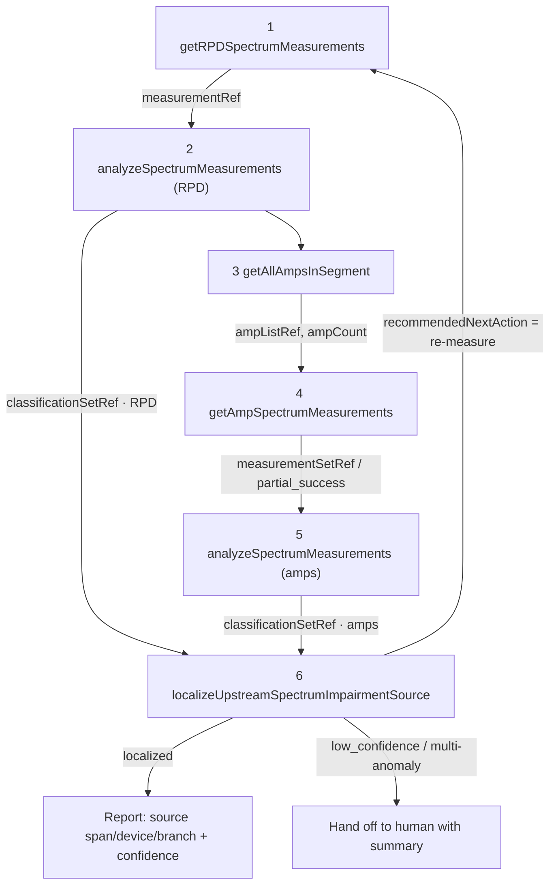

# Upstream Impairment Localization - Intel POC

Agentic upstream-impairment localization for vCMTS/DOCSIS upstream networks. The system runs a
fixed 6-step MCP tool chain where the SLM orchestrates tool calls and error handling, while
classification and localization remain deterministic components.

Primary source docs merged into this README:
- `../SCTE-Plan-Corrected.md`
- `CABLELABS-HANDOFF.md`
- `EXECUTION_STEPS.md`

## What This Repository Implements

- A runnable POC for upstream impairment localization with one-shot amplifier measurement per leg.
- An MCP reference surface where the SLM sees handles and counts, not raw spectra arrays.
- A CPD-focused synthetic simulator, bootstrap rule classifier, and graph localizer.
- Two orchestration modes:
	- Deterministic orchestrator as grading oracle.
	- LangGraph SLM agent for tool-calling behavior.

## MCP Tool Chain (Fixed Sequence)

```
1 getRPDSpectrumMeasurements(rpdId, portId)          -> measurementRef
2 analyzeSpectrumMeasurements([measurementRef])      -> classificationSetRef (RPD)
3 getAllAmpsInSegment(rpdId, portId)                 -> ampListRef, ampCount, segmentId
4 getAmpSpectrumMeasurements(ampListRef)             -> measurementSetRef (or partial_success)
5 analyzeSpectrumMeasurements(measurementSetRef)     -> classificationSetRef (amps)
6 localizeUpstreamSpectrumImpairmentSource(...)      -> localized or low_confidence + next action
```

This flow is one-shot over the amplifier leg, not recursive drill-down.

## Data Surfaces: Handles vs Raw

- Reference surface (SLM-facing):
	- `measurementRef`, `measurementSetRef`, `ampListRef`, `classificationSetRef`, counts.
	- Includes explicit success, error, and `partial_success` shapes.
- Raw surface (backend-only):
	- `rawSpectrum` traces (`maxHold`, `minHold`, `average`) with 256 bins over 5-85 MHz.
	- Inline classifier artifacts and topology internals used by server/localizer.

Contract details are documented in `docs/architecture/contract-and-data-surfaces.md`.

## Assumptions And Risks

- Capture defaults are 5-85 MHz, 256 bins, dBmV traces.
- CPD signature is provisional (floor rise, comb spacing, and band extent).
- Topology shape from `getAllAmpsInSegment` is assumed to include parent/children links.
- `impairmentType` selection rule for step 6 currently uses dominant non-Clean signal.
- Rule-based classifier is scaffolding; production accuracy depends on CNN integration.

Full tracked assumptions and owner asks remain in `CABLELABS-HANDOFF.md`.

## Open Decisions And Owners

- Irene/Bhaskar:
	- Final CPD spectral signature parameters.
	- CNN reuse/training details and 7-class to 9-label mapping.
	- Confidence calibration semantics for clean vs impaired thresholds.
- Randy:
	- Real `getAllAmpsInSegment` payload shape and sample topology.
	- Trigger contract (SNMP trap or Kafka schema).
	- OpenShift/OCP validation timeline and scale expectations.
- Randy + Irene:
	- Error taxonomy completeness and `partial_success` contract confirmation.
	- Human handoff content requirements for operator actionability.

Decision tracker: `docs/operations/open-decisions.md`.

## Project Layout

| Path | Purpose |
|------|---------|
| `schemas/tools/` | Vendored MCP JSON schemas (reference and raw surfaces) |
| `src/uil/domain/` | Pydantic schema mirrors |
| `src/uil/sim/` | Upstream spectrum simulator |
| `src/uil/classifier/` | Bootstrap rule classifier |
| `src/uil/localizer/` | Graph-theory localizer |
| `src/uil/mcp_server/` | Mock MCP server and handle store |
| `src/uil/agent/` | Deterministic orchestrator, LangGraph agent, traces, handoff |
| `tests/` | Conformance, simulator, localizer, E2E tests |

## Demo Quickstart

```bash
cd upstream-impairment

make install
make test
make demo

# Optional SLM orchestration demo (OpenAI-compatible endpoint required)
export SLM_BASE_URL=http://localhost:8000/v1
export SLM_MODEL=<served-model-name>
export OPENAI_API_KEY=EMPTY
make agent-demo
```

Expected deterministic demo output (abridged):

```
Scenario 1: full localization -> localized
Scenario 2: partial_success + escalation -> low_confidence
```

## Current Status

- POC baseline is runnable end-to-end on synthetic CPD data.
- Test suite baseline: 29 tests passing.
- Next hardening focus:
	- CNN integration behind `analyzeSpectrumMeasurements`.
	- Topology-shape resilience in localizer.
	- Contract-tight error and `partial_success` handling.

Execution tracker: `EXECUTION_STEPS.md`.

---

## Appendix: Corrected Plan Content (What Changed Section Excluded)

# Plan (Corrected): Agentic Upstream Impairment Localization for vCMTS Cable Networks

Supersedes SCTE - Plan (1). This version is reconciled against the actual MCP tool
contract in OneDrive_2_6-17-2026.zip (docs + schemas/tools) and the
GMT20260612 design call transcript.

## 1. Validated requirements

- Problem: Localize the physical source of an upstream spectrum impairment in a DOCSIS
	cascade (RPD port -> amplifiers -> ...), driven by an SLM that orchestrates MCP tools.
- Trigger: SNMP trap as secondary indicator or Kafka streaming telemetry (1/min, but
	~75k modems/CPU -> scaling concern). Evaluating if it's a multi-channel upstream issue
	kicks off the process. Full spectrum capture is an on-demand, expensive operation,
	not continuous.
- Data Collection Strategy (One-Shot): Intermittent impairments are common. Hierarchical
	serial querying risks missing intermittent signals due to time-alignment issues. The
	plan explicitly requires querying all amplifiers in the leg simultaneously/in one batch.
- Two data surfaces:
	- Reference (SLM-facing): the SLM only ever moves handles + counts
		(measurementRef, classificationSetRef, ampListRef, measurementSetRef). It never
		holds raw spectra. This keeps SLM context small and is the contract we must honor.
	- Raw (implementer/backend): actual rawSpectrum traces and inline classifications[]
		moved between backend services.
- Classifier: CNN multi-class over spectrum captures (reuse/retrain Bhaskar's prior
	full-band CNN). Output: class in 9 labels + confidence + optional observations[].
- Localizer: graph-theory/common-point analysis over segment topology, as its own tool
	(not an LLM step). Output is symbolic (span/device/branch + candidates + boundary
	device sets + recommendedNextAction).
- Execution: simulator first (synthetic realistic upstream spectra, CPD-focused) -> plan
	for live vCMTS/RPD integration. Real amplifier data not yet available; may be emulated
	and will resemble RPD upstream captures.
- Paper: due ~July. Focus the contribution on the tool chain + tool calling + the causal/
	localization model, with SLM fine-tuning for reliable tool orchestration.

## 2. The fixed tool-call sequence (the agent's happy path)

From slide2 of upstream_mcp_tools.pptx. Steps 2 and 5 are the same tool run on
different measurement sets.

```text
1  getRPDSpectrumMeasurements(rpdId, portId)            -> measurementRef
2  analyzeSpectrumMeasurements(measurementRefs=[ref])   -> classificationSetRef · RPD   (kept for step 6)
3  getAllAmpsInSegment(rpdId, portId)                   -> ampListRef, ampCount, segmentId
4  getAmpSpectrumMeasurements(ampListRef)               -> measurementSetRef  (may be partial_success)
5  analyzeSpectrumMeasurements(measurementSetRef)       -> classificationSetRef · amps
6  localizeUpstreamSpectrumImpairmentSource(
			 rpdId, portId, impairmentType,
			 classificationSetRefs=[RPD set (2), amp set (5)]) -> localization + recommendedNextAction
																													↻ recommendedNextAction may say "re-measure"
```



The SLM's real job is everything off the happy path: choose measurementRefs[] vs
measurementSetRef, choose ampIds[] vs ampListRef, react to each tool's error/
partial_success, decide whether to re-measure (per recommendedNextAction), and decide when to
escalate to a human (ambiguous/multi-anomaly cases).

## 3. Domain model (Pydantic v2) - mirror the schemas exactly

Source of truth: schemas/tools/_defs.schema.json. Models live in src/domain/ and
must round-trip the JSON schemas.

```python
# src/domain/labels.py
class ImpairmentLabel(str, Enum):
		Clean = "Clean"; CPD = "CPD"; Ingress = "Ingress"
		ImpulseNoise = "ImpulseNoise"; WidebandNoise = "WidebandNoise"
		NarrowbandInterference = "NarrowbandInterference"; Ripple = "Ripple"
		Suckout = "Suckout"; UnknownImpairment = "UnknownImpairment"

# src/domain/spectrum.py
class SpectrumTraces(BaseModel):     # all arrays length == numBins
		maxHold: list[float]; minHold: list[float]; average: list[float]

class RawSpectrum(BaseModel):
		startFrequencyHz: int            # default capture 5_000_000
		stopFrequencyHz: int             # default capture 85_000_000
		numBins: int = Field(ge=1)       # default 256
		traces: SpectrumTraces
		# bin i center = start + (i + 0.5) * (stop - start) / numBins

# src/domain/refs.py  (reference-surface handles + identity)
class DeviceRef(BaseModel):          # discriminated: RPD(rpdId+portId) | AMP(ampId+portId?)
		...
class MeasurementRef(BaseModel):     # measurementId, deviceType, measurementType, timestamp, validUntil?
		...

# src/domain/classification.py
class Observation(BaseModel):
		finding: str; supports: list[str] = []; confidence: float | None = None
class Classification(BaseModel):
		deviceType: Literal["RPD","AMP"]; measurementId: str
		rpdId: str | None = None; portId: str | None = None; ampId: str | None = None
		status: Literal["impaired","clean"]
		klass: ImpairmentLabel = Field(alias="class")
		confidence: float = Field(ge=0, le=1)
		observations: list[Observation] = []

# src/domain/localization.py  -> mirrors localize output (span/device/branch, candidates, ...)
# src/domain/errors.py        -> ErrorResponse{status:"error", errorCode, message?}
```

Per-tool error code enums (model as Literals so the orchestrator can branch):
- getRPDSpectrumMeasurements: MEASUREMENT_UNAVAILABLE, DEVICE_UNREACHABLE, INVALID_RPD_PORT, STALE_DATA_ONLY, PERMISSION_DENIED
- analyzeSpectrumMeasurements: CLASSIFICATION_FAILED, INVALID_MEASUREMENT_REF, MEASUREMENT_TOO_STALE, UNSUPPORTED_MEASUREMENT_TYPE, INSUFFICIENT_SIGNAL_QUALITY
- getAllAmpsInSegment: TOPOLOGY_UNAVAILABLE, INVALID_RPD_PORT, EMPTY_SEGMENT, STALE_TOPOLOGY, PERMISSION_DENIED
- getAmpSpectrumMeasurements: AMP_MEASUREMENTS_UNAVAILABLE, DEVICE_UNREACHABLE, INVALID_AMP_ID, INVALID_AMP_LIST_REF, TOO_MANY_DEVICES_REQUESTED, STALE_DATA_ONLY, PERMISSION_DENIED (+ partial_success with failedCount/failedDevicesRef)
- localizeUpstreamSpectrumImpairmentSource: INSUFFICIENT_LOCALIZATION_EVIDENCE, TOPOLOGY_UNAVAILABLE, INVALID_CLASSIFICATION_SET_REF (+invalidClassificationSetRefs[]), NO_IMPAIRMENT_CONFIRMED, CONFLICTING_CLASSIFICATIONS, UNSUPPORTED_IMPAIRMENT_TYPE

## 4. Components to build

### 4.1 MCP server exposing the 5 tools (src/mcp_server/)

The reference surface is what the SLM calls; the backend resolves handles to raw payloads.

- A handle/ref store (in-memory + pluggable) that maps:
	measurementId -> RawSpectrum, measurementSetRef -> [measurements],
	ampListRef -> amp list/topology, classificationSetRef -> [Classification].
	This is the mechanism that keeps raw data out of SLM state.
- Each tool returns oneOf(success | error [| partial_success]) exactly per its
	outputSchema. Validate I/O against the JSON schemas in CI.

### 4.2 Upstream spectrum simulator (src/sim/spectrum_simulator.py)

Generates realistic upstream rawSpectrum (5-85 MHz, 256 bins) with per-bin
maxHold/minHold/average, plus fault injectors keyed to the 9 labels. Start with CPD.

CPD model (primary): elevated/raised noise floor across the upstream band (optionally with
characteristic comb/discrete-distortion-product structure), parameterized by severity and
band extent; Clean = nominal floor with realistic variance. Stub the other labels
(Ingress, NarrowbandInterference, Suckout/Ripple, ImpulseNoise/WidebandNoise,
UnknownImpairment). Deterministic seed for tests.

### 4.3 Classifier (src/classifier/)

- analyzeSpectrumMeasurements is backed by a CNN multi-class model over the spectrum trace
	(reuse/retrain Bhaskar's prior full-band-capture CNN).
- Bootstrap fallback: transparent rule/threshold classifier on the noise floor so the full
	tool chain runs end-to-end before CNN training.
- Output conforms to classification def: class, confidence, optional observations[].

### 4.4 Localizer (src/localizer/)

Graph-theory common-point analysis over segment topology (amps[] with parentId/children/
distanceFromRpdMeters from getAllAmpsInSegment raw output):
- Pool RPD + amp classifications (split by deviceType).
- Find the common upstream point bounded by impaired-vs-clean devices.
- Emit likelySourceLocation (span/device/branch), candidateLocations[],
	supportingDevices[], cleanBoundaryDevices[], uncertainDevices[],
	recommendedNextAction, and localizationStatus (localized | low_confidence).
- Multi-anomaly/conflicting labels -> low_confidence or CONFLICTING_CLASSIFICATIONS ->
	agent escalates to human with a summary.

### 4.5 SLM orchestrator (src/agent/, LangGraph)

State machine implementing the 6-step sequence plus exception handling:
- Nodes: measure_rpd -> classify_rpd -> list_amps -> measure_amps -> classify_amps -> localize,
	with conditional edges for error/partial_success/re-measure/escalate.
- Maintains only handles + counts in state.
- SLM chooses tool args (refs vs set handles, ids vs list handle) and recovery actions.
- Fine-tuning target: reliable tool selection/sequencing + recovery, using positive/negative
	traces generated from the simulator.

## 5. Error and partial_success handling (must-have, per contract)

- getAmpSpectrumMeasurements -> partial_success: proceed with measured amps; record
	failedCount / resolve failedDevicesRef; localizer treats missing legs as uncertainDevices;
	agent may re-measure failed amps.
- STALE_DATA_ONLY / MEASUREMENT_TOO_STALE -> re-capture before classifying.
- INVALID_CLASSIFICATION_SET_REF returns invalidClassificationSetRefs[] -> agent knows whether
	the RPD set or amp set failed and re-runs only that branch.
- NO_IMPAIRMENT_CONFIRMED / CONFLICTING_CLASSIFICATIONS -> stop, summarize, escalate.

## 6. Phased roadmap (paper due ~July)

Phase 0 - Schemas as code (foundation)
- Vendor schemas/tools/**, generate/author Pydantic models, add CI check validating tool I/O
	examples against .schema.json.

Phase 1 - MCP server + handle store + CPD simulator
- Implement the 5 tools against the reference surface with in-memory handle store; simulator
	emits CPD + Clean upstream spectra; bootstrap rule classifier for E2E.

Phase 2 - CNN classifier + localizer hardening
- Integrate CNN, flesh out fault injectors, harden graph localization including multi-anomaly
	-> human handoff.

Phase 3 - SLM orchestration + fine-tuning
- LangGraph agent drives full sequence with error/partial/re-measure handling; generate traces;
	fine-tune local SLM for tool selection/sequencing/recovery.

Phase 4 - Live integration roadmap (post-paper)
- Intel develops and runs locally (Phase 1-3), then deploys to CableLabs OCP for validation.
- Replace simulator behind same MCP reference surface with real capture; emulate amp data until
	smart-amp hardware/transponders are available.

## 7. Testing and verification

- Schema conformance (Phase 0): every tool success/error/partial example validates against schemas/tools/**.
- Simulator quality: CPD raises floor by configured margin; Clean stays within variance; signatures are distinguishable.
- Classifier: per-label precision/recall on held-out synthetic spectra; confidence calibration.
- Localizer scenarios: known-span CPD localization, multi-anomaly escalation, partial amp coverage uncertainDevices.
- Agent E2E: full 6-step sequence, injected tool errors/partial_success/re-measure, correct handoff summary path.
- SLM tool-calling: correct tool+args rate, recovery success rate, tuned vs untuned comparison.

## 8. Proposed file structure

```text
upstream-impairment/
├── pyproject.toml
├── schemas/tools/
│   ├── _defs.schema.json
│   ├── reference/*.schema.json
│   └── raw/*.schema.json
├── src/
│   ├── domain/
│   │   ├── labels.py  spectrum.py  refs.py  classification.py  localization.py  errors.py
│   ├── sim/spectrum_simulator.py
│   ├── classifier/
│   ├── localizer/
│   ├── mcp_server/
│   │   ├── tools.py  handle_store.py  server.py
│   └── agent/
│       ├── graph.py  state.py  llm_client.py  prompts.py
├── tests/
│   ├── test_schema_conformance.py  test_simulator.py  test_classifier.py
│   ├── test_localizer.py  test_agent_e2e.py
│   └── fixtures/
├── config/
│   ├── capture_defaults.yaml
│   ├── cpd_signatures.yaml
│   └── llm.yaml
└── README.md
```

## 9. Open questions / confirm with CableLabs + Intel

1. CPD spectral signature specifics (floor rise margin, discrete-product structure, band extent).
2. CNN reuse: input shape/normalization vs 256-bin upstream traces; retrain plan and 7-class -> 9-label mapping.
3. Topology availability: whether getAllAmpsInSegment raw output includes amps[] with parentId/children/distance.
4. Trigger contract: exact SNMP-trap payload and optional Kafka schema.
5. impairmentType rule for localize step 6: derived from RPD classesPresent or chosen by SLM.
6. SLM choice for fine-tuning (1B vs 7B+) and tool-call trace format.

## 10. Strategic recommendations for July deliverable

1. Accelerate orchestrator development with LLM-generated synthetic datasets so agent behavior can
	 be evaluated before full RF simulator maturity.
2. Aggressively inject error paths (partial_success, DEVICE_UNREACHABLE) because paper value is
	 in recovery behavior, not only happy-path execution.
3. Standardize human handoff syntax as a diagnosis summary markdown artifact with evidence and
	 escalation reason.
4. Mock deployment constraints now (local MCP server) until OpenShift access is available.

## 11. Summary

Build an MCP tool chain (5 tools, reference handles vs raw payloads) for upstream spectrum
impairment localization, driven by a local SLM orchestrator (LangGraph) that runs the fixed
6-step sequence and handles errors/partial_success/re-measure/human-handoff. Classification is
a CNN (analyzeSpectrumMeasurements) over upstream rawSpectrum; localization is graph-theory
common-point analysis over topology (not recursive drill-down). Start with CPD-focused synthetic
simulator behind the same reference surface, then swap in live RPD/CMTS data without changing
the contract.
