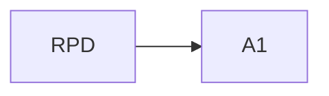
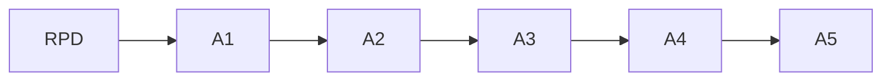
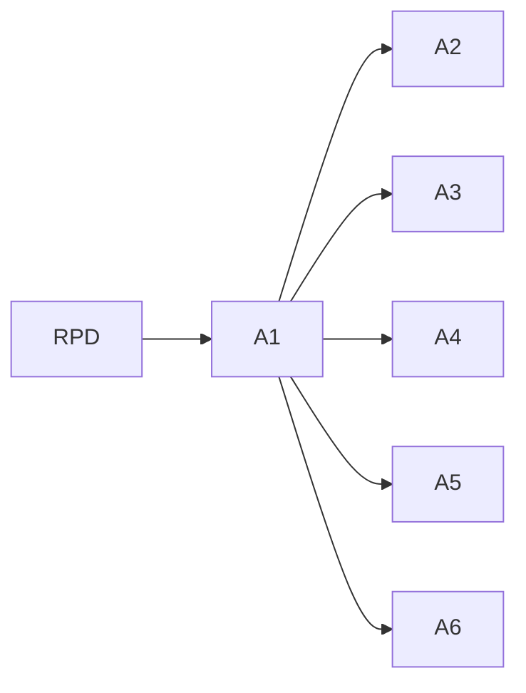
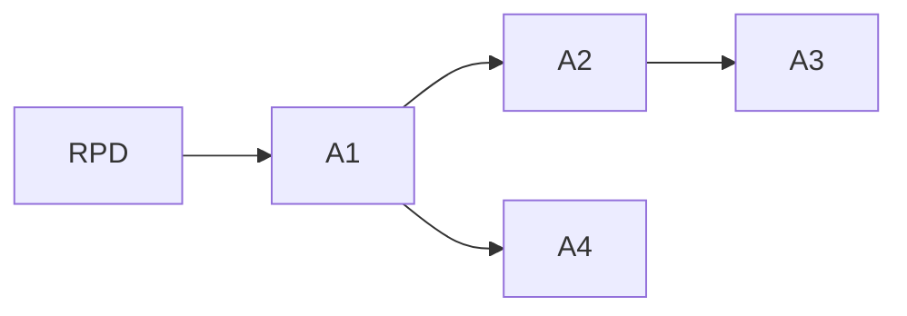
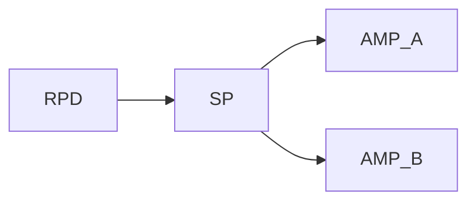
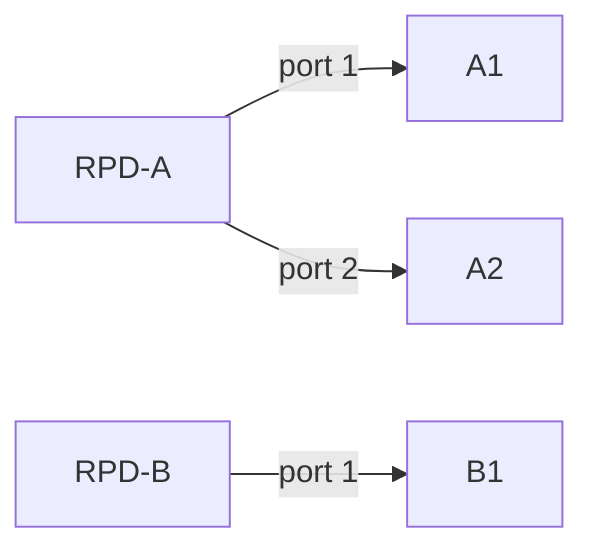
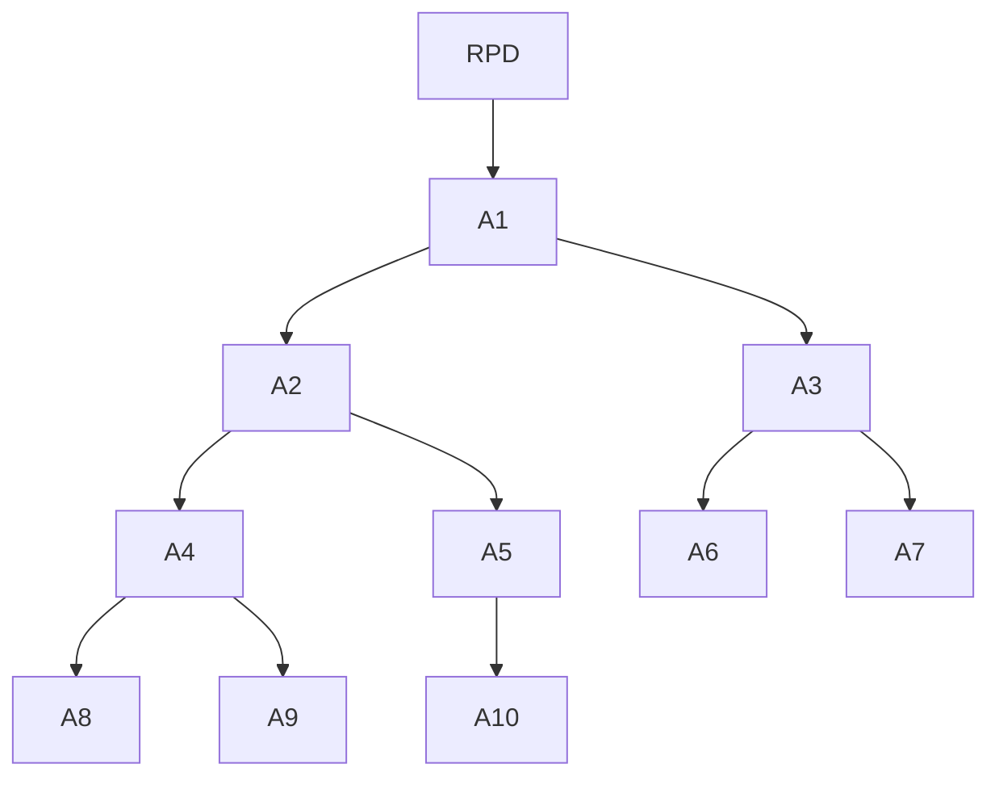

# Validation Topologies

Representative plant topologies exercised during validation of the localizer + orchestrator.
Every case below is **synthetic and authored by us** (safe to publish) and is asserted directly
in the test suite, so the claims here are traceable to green tests.

> Redistribution note: the two real CableLabs sample plants and the 211‑overlay corpus are
> **not** reproduced here. "example/test" does not establish a redistribution license, so those
> fixtures are withheld pending confirmation; only aggregate structural stats are shown
> (see [Real plants](#real-plants-stats-only-withheld)). Diagrams and raw shapes below are
> synthetic equivalents.

## Why these shapes

The goal is to prove the parser + localizer generalize to plant **structure**, not to any two
sample files. The synthetic shapes cover the localization regimes the paper claims: single
device, span between a clean boundary and an impaired cluster, branch/common‑point, root fault,
passive common point, missing‑measurement uncertainty, and multi‑anomaly conflict.

Legend: `RPD` = fiber node / remote PHY root; `Ax` = amplifier (measured); `SP` = splitter
(passive). Upstream signal flows from the leaves toward the RPD, so an impairment propagates to
every device on the path from the fault up to the RPD.

## Synthetic topologies

### 1. Single‑amp segment

- Fault at `A1` → `localized`, `locationType = device`, downstream boundary `A1`.
- `A1` clean but RPD impaired → `low_confidence` (possible intermittent/upstream); full 6‑step
  chain still runs.

### 2. Linear chain

- Fault enters at `A3` (so `A3,A4,A5` impaired; `A1,A2` clean) → common point `A3`, supporting
  `{A3,A4,A5}`, clean boundary includes `A2`.
- Only the deepest amp impaired (`A3` in a 3‑chain) → `locationType = device`.

### 3. Wide star

- One leaf impaired (`A2`) → `device`, downstream boundary `A2`, clean boundary includes `A1`.
- Two leaves impaired (`A2`,`A4`) → LCA is `A1` → branch / `low_confidence`.

### 4. Root fault (all amps impaired)

- All amps impaired → common point `A1` → `branch` at the root; supporting `{A1,A2,A3,A4}`.

### 5. Passive common point (splitter)

- Both branch amps impaired → internal common point is the passive `SP`. The public output
  never emits a passive ref: it maps to the nearest measurable **RPD/AMP** boundary
  (`upstreamBoundaryDevice = RPD`), while the internal description still names `SP`.
- Connectors (ports/cables) and subscriber homes are collapsed; cable `length` accumulates into
  `distanceFromRpdMeters`.

### 6. Multi‑port RPD scoping

- `getAllAmpsInSegment(RPD-A, port 2)` scopes to that port's descendants only → `{A2}`.
- Unknown RPD id or unknown port → `INVALID_RPD_PORT` (`InvalidRpdPortError`).

### 7. Large segment (stress)

- `A3` branch impaired (`A3,A6,A7`) → completes the full 6‑step chain; supporting ⊇ `{A3,A6,A7}`.

## Outcome table

| Topology | Fault pattern | Expected `localizationStatus` | Candidate `locationType` | Notes |
|---|---|---|---|---|
| Single amp | `A1` impaired | `localized` | `device` | downstream `A1` |
| Single amp | amps clean, RPD impaired | `low_confidence` | — | possible intermittent |
| Linear chain | mid‑chain (`A3+`) | `localized` | `span`/`branch` | clean boundary `A2`, supporting `{A3,A4,A5}` |
| Linear chain | deepest only | `localized` | `device` | leaf fault |
| Wide star | one leaf | `localized` | `device` | clean boundary = root |
| Wide star | two leaves | `localized`/`low_confidence` | `branch` | LCA at root |
| Root fault | all impaired | `localized` | `branch` | common point = root amp |
| Passive splitter | both branches | `localized` | `branch` | boundary = nearest RPD/AMP, not `SP` |
| Conflicting labels | CPD vs Ingress | `low_confidence` | `branch` | multi‑anomaly → escalate |
| Partial success | one amp unreachable | `localized`/`low_confidence` | varies | missing leg → `uncertainDevicesRef` |
| Multi‑port | scope to one port | n/a (parse) | — | descendants of that port only |

Evidence (supporting / clean‑boundary / uncertain device lists) is returned behind the
`supportingDevicesRef` / `cleanBoundaryDevicesRef` / `uncertainDevicesRef` handles per candidate,
per the CableLabs‑aligned contract; the ids above are what those handles resolve to.

## Traceability to tests

- Synthetic shapes 1–4, 7 and the partial‑success / conflicting / CNN variants:
  [tests/test_topologies.py](../../tests/test_topologies.py).
- Passive common point, connector collapse, cable‑length accumulation, multi‑port scoping,
  unknown‑type tolerance, `INVALID_RPD_PORT`, and amp‑list handle chaining:
  [tests/test_plant_topology.py](../../tests/test_plant_topology.py).
- Public localize output schema conformance:
  [tests/test_schema_conformance.py](../../tests/test_schema_conformance.py)
  (`test_localize_tool_success_output_conforms`).

## Real plants (stats only, withheld)

The parser + localizer are also unit‑tested directly against the two real CableLabs
data‑package sample plants. The raw fixtures are **not** published here; only structural
aggregates are reported:

| Plant | Measured amps (`RfAmp`) | Passive devices | Orphans |
|---|---|---|---|
| example‑1 | 74 | 382 | 0 |
| example‑2 | 47 | (passive fabric present) | 0 |

Both parse cleanly, resolve a single `RfSource` root with downstream‑oriented edges, and scope
to a requested `portId`'s descendants. Publishing the raw plants (or the 211‑overlay corpus)
requires confirmed redistribution permission.
