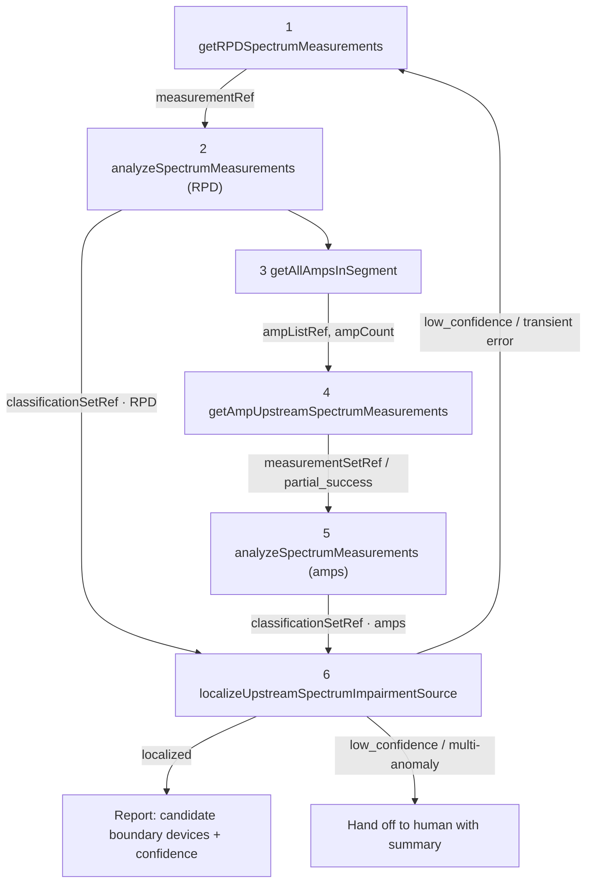

# Corrected Plan: Agentic Upstream Impairment Localization (vCMTS)

> Moved out of `README.md` (was "Appendix: Corrected Plan Content"). This is the reconciled
> design plan; see the Addendum at the end for what has since been implemented.

# Plan (Corrected): Agentic Upstream Impairment Localization for vCMTS Cable Networks

Supersedes SCTE - Plan (1). This version is reconciled against the actual MCP tool
contract in OneDrive_2_6-17-2026.zip (docs + schemas/tools) and the
GMT20260612 design call transcript.

## 1. Validated requirements

- Problem: Localize the physical source of an upstream spectrum impairment in a DOCSIS
	cascade (RPD port -> amplifiers -> ...), driven by an SLM that orchestrates MCP tools.
- Trigger: SNMP trap as secondary indicator or Kafka streaming telemetry (1/min, but
	~75k modems/CPU -> scaling concern). Evaluating if it's a multi-channel upstream issue
	kicks off the process. Full spectrum capture is an on-demand, expensive operation,
	not continuous.
- Data Collection Strategy (One-Shot): Intermittent impairments are common. Hierarchical
	serial querying risks missing intermittent signals due to time-alignment issues. The
	plan explicitly requires querying all amplifiers in the leg simultaneously/in one batch.
- Two data surfaces:
	- Reference (SLM-facing): the SLM only ever moves handles + counts
		(measurementRef, classificationSetRef, ampListRef, measurementSetRef). It never
		holds raw spectra. This keeps SLM context small and is the contract we must honor.
	- Raw (implementer/backend): actual rawSpectrum traces and inline classifications[]
		moved between backend services.
- Classifier: CNN multi-class over spectrum captures (reuse/retrain Bhaskar's prior
	full-band CNN). Output: class in 9 labels + confidence + optional observations[].
- Localizer: graph-theory/common-point analysis over segment topology, as its own tool
	(not an LLM step). Output is symbolic (span/device/branch + candidates + boundary
	device sets + recommendedNextAction).
- Execution: simulator first (synthetic realistic upstream spectra, CPD-focused) -> plan
	for live vCMTS/RPD integration. Real amplifier data not yet available; may be emulated
	and will resemble RPD upstream captures.
- Paper: due ~July. Focus the contribution on the tool chain + tool calling + the causal/
	localization model, with SLM fine-tuning for reliable tool orchestration.

## 2. The fixed tool-call sequence (the agent's happy path)

From slide2 of upstream_mcp_tools.pptx. Steps 2 and 5 are the same tool run on
different measurement sets.

```text
1  getRPDSpectrumMeasurements(rpdId, portId)            -> measurementRef
2  analyzeSpectrumMeasurements(measurementRefs=[ref])   -> classificationSetRef · RPD   (kept for step 6)
3  getAllAmpsInSegment(rpdId, portId)                   -> ampListRef, ampCount
4  getAmpUpstreamSpectrumMeasurements(ampListRef)       -> measurementSetRef  (may be partial_success)
5  analyzeSpectrumMeasurements(measurementSetRef)       -> classificationSetRef · amps
6  localizeUpstreamSpectrumImpairmentSource(
			 rpdId, portId, impairmentType?=CPD,
			 classificationSetRefs=[RPD set (2), amp set (5)]) -> candidateLocations[] (boundary devices + evidence handles)
																							↻ orchestrator may re-measure on low_confidence / transient error
```



The SLM's real job is everything off the happy path: choose measurementRefs[] vs
measurementSetRef, choose ampIds[] vs ampListRef, react to each tool's error/
partial_success, decide whether to re-measure (per recommendedNextAction), and decide when to
escalate to a human (ambiguous/multi-anomaly cases).

## 3. Domain model (Pydantic v2) - mirror the schemas exactly

Source of truth: schemas/tools/_defs.schema.json. Models live in src/domain/ and
must round-trip the JSON schemas.

```python
# src/domain/labels.py
class ImpairmentLabel(str, Enum):
		Clean = "Clean"; CPD = "CPD"; Ingress = "Ingress"
		ImpulseNoise = "ImpulseNoise"; WidebandNoise = "WidebandNoise"
		NarrowbandInterference = "NarrowbandInterference"; Ripple = "Ripple"
		Suckout = "Suckout"; UnknownImpairment = "UnknownImpairment"

# src/domain/spectrum.py
class SpectrumTraces(BaseModel):     # all arrays length == numBins
		maxHold: list[float]; minHold: list[float]; average: list[float]

class RawSpectrum(BaseModel):
		startFrequencyHz: int            # default capture 5_000_000
		stopFrequencyHz: int             # default capture 85_000_000
		numBins: int = Field(ge=1)       # default 256
		traces: SpectrumTraces
		# bin i center = start + (i + 0.5) * (stop - start) / numBins

# src/domain/refs.py  (reference-surface handles + identity)
class DeviceRef(BaseModel):          # discriminated: RPD(rpdId+portId) | AMP(ampId+portId?)
		...
class MeasurementRef(BaseModel):     # measurementId, deviceType, measurementType, timestamp, validUntil?
		...

# src/domain/classification.py
class Observation(BaseModel):
		finding: str; supports: list[str] = []; confidence: float | None = None
class Classification(BaseModel):
		deviceType: Literal["RPD","AMP"]; measurementId: str
		rpdId: str | None = None; portId: str | None = None; ampId: str | None = None
		status: Literal["impaired","clean"]
		klass: ImpairmentLabel = Field(alias="class")
		confidence: float = Field(ge=0, le=1)
		observations: list[Observation] = []

# src/domain/localization.py  -> mirrors localize output (span/device/branch, candidates, ...)
# src/domain/errors.py        -> ErrorResponse{status:"error", errorCode, message?}
```

Per-tool error code enums (model as Literals so the orchestrator can branch):
- getRPDSpectrumMeasurements: MEASUREMENT_UNAVAILABLE, DEVICE_UNREACHABLE, INVALID_RPD_PORT, STALE_DATA_ONLY, PERMISSION_DENIED
- analyzeSpectrumMeasurements: CLASSIFICATION_FAILED, INVALID_MEASUREMENT_REF, MEASUREMENT_TOO_STALE, UNSUPPORTED_MEASUREMENT_TYPE, INSUFFICIENT_SIGNAL_QUALITY
- getAllAmpsInSegment: TOPOLOGY_UNAVAILABLE, INVALID_RPD_PORT, EMPTY_SEGMENT, STALE_TOPOLOGY, PERMISSION_DENIED
- getAmpUpstreamSpectrumMeasurements: AMP_MEASUREMENTS_UNAVAILABLE, DEVICE_UNREACHABLE, INVALID_AMP_ID, INVALID_AMP_LIST_REF, TOO_MANY_DEVICES_REQUESTED, STALE_DATA_ONLY, PERMISSION_DENIED (+ partial_success with failedCount/failedDevicesRef)
- localizeUpstreamSpectrumImpairmentSource: INSUFFICIENT_LOCALIZATION_EVIDENCE, TOPOLOGY_UNAVAILABLE, INVALID_CLASSIFICATION_SET_REF (+invalidClassificationSetRefs[]), NO_IMPAIRMENT_CONFIRMED, CONFLICTING_CLASSIFICATIONS, UNSUPPORTED_IMPAIRMENT_TYPE

## 4. Components to build

### 4.1 MCP server exposing the 5 tools (src/mcp_server/)

The reference surface is what the SLM calls; the backend resolves handles to raw payloads.

- A handle/ref store (in-memory + pluggable) that maps:
	measurementId -> RawSpectrum, measurementSetRef -> [measurements],
	ampListRef -> amp list/topology, classificationSetRef -> [Classification].
	This is the mechanism that keeps raw data out of SLM state.
- Each tool returns oneOf(success | error [| partial_success]) exactly per its
	outputSchema. Validate I/O against the JSON schemas in CI.

### 4.2 Upstream spectrum simulator (src/sim/spectrum_simulator.py)

Generates realistic upstream rawSpectrum (5-85 MHz, 256 bins) with per-bin
maxHold/minHold/average, plus fault injectors keyed to the 9 labels. Start with CPD.

CPD model (primary): elevated/raised noise floor across the upstream band (optionally with
characteristic comb/discrete-distortion-product structure), parameterized by severity and
band extent; Clean = nominal floor with realistic variance. Stub the other labels
(Ingress, NarrowbandInterference, Suckout/Ripple, ImpulseNoise/WidebandNoise,
UnknownImpairment). Deterministic seed for tests.

### 4.3 Classifier (src/classifier/)

- analyzeSpectrumMeasurements is backed by a CNN multi-class model over the spectrum trace
	(reuse/retrain Bhaskar's prior full-band-capture CNN).
- Bootstrap fallback: transparent rule/threshold classifier on the noise floor so the full
	tool chain runs end-to-end before CNN training.
- Output conforms to classification def: class, confidence, optional observations[].

### 4.4 Localizer (src/localizer/)

Graph-theory common-point analysis over segment topology (amps[] with parentId/children/
distanceFromRpdMeters from getAllAmpsInSegment raw output):
- Pool RPD + amp classifications (split by deviceType).
- Find the common upstream point bounded by impaired-vs-clean devices.
- Public output (aligned to CableLabs 2026-07-11): `candidateLocations[]`, each with
	`upstreamBoundaryDevice` + plural `downstreamBoundaryDevices[]` and evidence behind
	`supportingDevicesRef` / `cleanBoundaryDevicesRef` / `uncertainDevicesRef` handles, plus
	`localizationStatus` (localized | low_confidence). The internal `GraphLocalizer` still computes
	inline `likelySourceLocation`/evidence/`recommendedNextAction`; the server converts it to the
	handle-backed public contract via `build_public_localization`.
- Multi-anomaly/conflicting labels -> low_confidence or CONFLICTING_CLASSIFICATIONS ->
	agent escalates to human with a summary.

Representative validated shapes (synthetic, publishable) and their expected outcomes are
documented in [architecture/validation-topologies.md](architecture/validation-topologies.md).

### 4.5 SLM orchestrator (src/agent/, LangGraph)

State machine implementing the 6-step sequence plus exception handling:
- Nodes: measure_rpd -> classify_rpd -> list_amps -> measure_amps -> classify_amps -> localize,
	with conditional edges for error/partial_success/re-measure/escalate.
- Maintains only handles + counts in state.
- SLM chooses tool args (refs vs set handles, ids vs list handle) and recovery actions.
- Fine-tuning target: reliable tool selection/sequencing + recovery, using positive/negative
	traces generated from the simulator.

## 5. Error and partial_success handling (must-have, per contract)

- getAmpSpectrumMeasurements -> partial_success: proceed with measured amps; record
	failedCount / resolve failedDevicesRef; localizer treats missing legs as uncertainDevices;
	agent may re-measure failed amps.
- STALE_DATA_ONLY / MEASUREMENT_TOO_STALE -> re-capture before classifying.
- INVALID_CLASSIFICATION_SET_REF returns invalidClassificationSetRefs[] -> agent knows whether
	the RPD set or amp set failed and re-runs only that branch.
- NO_IMPAIRMENT_CONFIRMED / CONFLICTING_CLASSIFICATIONS -> stop, summarize, escalate.

## 6. Phased roadmap (paper due ~July)

Phase 0 - Schemas as code (foundation)
- Vendor schemas/tools/**, generate/author Pydantic models, add CI check validating tool I/O
	examples against .schema.json.

Phase 1 - MCP server + handle store + CPD simulator
- Implement the 5 tools against the reference surface with in-memory handle store; simulator
	emits CPD + Clean upstream spectra; bootstrap rule classifier for E2E.

Phase 2 - CNN classifier + localizer hardening
- Integrate CNN, flesh out fault injectors, harden graph localization including multi-anomaly
	-> human handoff.

Phase 3 - SLM orchestration + fine-tuning
- LangGraph agent drives full sequence with error/partial/re-measure handling; generate traces;
	fine-tune local SLM for tool selection/sequencing/recovery.

Phase 4 - Live integration roadmap (post-paper)
- Intel develops and runs locally (Phase 1-3), then deploys to CableLabs OCP for validation.
- Replace simulator behind same MCP reference surface with real capture; emulate amp data until
	smart-amp hardware/transponders are available.

## 7. Testing and verification

- Schema conformance (Phase 0): every tool success/error/partial example validates against schemas/tools/**.
- Simulator quality: CPD raises floor by configured margin; Clean stays within variance; signatures are distinguishable.
- Classifier: per-label precision/recall on held-out synthetic spectra; confidence calibration.
- Localizer scenarios: known-span CPD localization, multi-anomaly escalation, partial amp coverage uncertainDevices.
- Agent E2E: full 6-step sequence, injected tool errors/partial_success/re-measure, correct handoff summary path.
- SLM tool-calling: correct tool+args rate, recovery success rate, tuned vs untuned comparison.

## 8. Proposed file structure

```text
upstream-impairment/
├── pyproject.toml
├── schemas/tools/
│   ├── _defs.schema.json
│   ├── reference/*.schema.json
│   └── raw/*.schema.json
├── src/
│   ├── domain/
│   │   ├── labels.py  spectrum.py  refs.py  classification.py  localization.py  errors.py
│   ├── sim/spectrum_simulator.py
│   ├── classifier/
│   ├── localizer/
│   ├── mcp_server/
│   │   ├── tools.py  handle_store.py  server.py
│   └── agent/
│       ├── graph.py  state.py  llm_client.py  prompts.py
├── tests/
│   ├── test_schema_conformance.py  test_simulator.py  test_classifier.py
│   ├── test_localizer.py  test_agent_e2e.py
│   └── fixtures/
├── config/
│   ├── capture_defaults.yaml
│   ├── cpd_signatures.yaml
│   └── llm.yaml
└── README.md
```

## 9. Open questions / confirm with CableLabs + Intel

1. CPD spectral signature specifics (floor rise margin, discrete-product structure, band extent).
2. CNN reuse: input shape/normalization vs 256-bin upstream traces; retrain plan and 7-class -> 9-label mapping.
3. Topology availability: whether getAllAmpsInSegment raw output includes amps[] with parentId/children/distance.
4. Trigger contract: exact SNMP-trap payload and optional Kafka schema.
5. impairmentType rule for localize step 6: derived from RPD classesPresent or chosen by SLM.
6. SLM choice for fine-tuning (1B vs 7B+) and tool-call trace format.

## 10. Strategic recommendations for July deliverable

1. Accelerate orchestrator development with LLM-generated synthetic datasets so agent behavior can
	 be evaluated before full RF simulator maturity.
2. Aggressively inject error paths (partial_success, DEVICE_UNREACHABLE) because paper value is
	 in recovery behavior, not only happy-path execution.
3. Standardize human handoff syntax as a diagnosis summary markdown artifact with evidence and
	 escalation reason.
4. Mock deployment constraints now (local MCP server) until OpenShift access is available.

## 11. Summary

Build an MCP tool chain (5 tools, reference handles vs raw payloads) for upstream spectrum
impairment localization, driven by a local SLM orchestrator (LangGraph) that runs the fixed
6-step sequence and handles errors/partial_success/re-measure/human-handoff. Classification is
a CNN (analyzeSpectrumMeasurements) over upstream rawSpectrum; localization is graph-theory
common-point analysis over topology (not recursive drill-down). Start with CPD-focused synthetic
simulator behind the same reference surface, then swap in live RPD/CMTS data without changing
the contract.

---

## Addendum (2026-07): implemented changes vs the plan

New CableLabs sample data arrived (`OneDrive_2_7-9-2026/`) in three groups: **Network Topology
Examples** (2 JSON), **Spectrum Capture Examples** (2 JSON), and **Alarms** (`alarms.json`).
This addendum records how the plan above has been realized/adjusted.

### Confirmed by the 2026-06-12 design call
- CableLabs will provide topology and is building the tool (Randy: "we'll have the topology
	stuff"; Chai building it). The extracted server confirms that topology is loaded as server
	configuration and only the downstream amp-id list is stored behind `ampListRef`; the plant
	graph is never sent to the SLM. So **topology-present is the default path**;
	`TOPOLOGY_UNAVAILABLE`/`STALE_TOPOLOGY`/`EMPTY_SEGMENT` are exceptions.

### Workflow entry: alarm trigger (new, implemented)
- `alarms.json` is an `eval_CPD` set of 26 labeled cases (positive/negative, with
  `expectedVerdict` and `expectedToolCall`). It defines the trigger contract.
- Gate: **call** iff `entity.type == "rpdPort"` AND `alarmType` in
  {`highUpstreamFecErrors`, `highUpstreamCorrectables`, `highUpstreamUncorrectables`,
  `highUpstreamCorrectablesAndUncorrectables`}; otherwise **noCall**. Both conditions required
  (hard negatives: upstream-FEC on a cable modem; non-FEC upstream on an RPD port).
- Implemented in `src/uil/agent/trigger.py`; wired into `Orchestrator.run_from_alarm` and
  `LangGraphAgent.run_from_alarm` (on `call`, step 1 is seeded with the alarm's
  `rpdId`/`portId`; on `noCall`, the workflow short-circuits with status `not_triggered`).
  Perfect on all 26 cases (`tests/test_trigger_eval.py`).

### Audit trace persistence (new, implemented \u2014 regulatory)
- `src/uil/agent/trace_store.py` `TraceStore`: append-only JSONL, **on by default**, written by
  both orchestration paths at every terminal outcome.
- **Tamper-evident** SHA-256 hash chain (`prevHash`/`recordHash`) with `TraceStore.verify()`;
  **daily rotation** (`tool_call_traces-YYYY-MM-DD.jsonl`); records carry `runId`,
  `recordedUtc`, `finalStatus`, `toolCallCount`, the trigger decision, and the handles-only
  trace (no raw spectra).
- Config: `UIL_TRACE_DIR` (default `./traces/`), `UIL_TRACE_DISABLE=1` to disable. Tests in
  `tests/test_trace_store.py`.

### Topology (adjusted: real shape differs from the plan's assumption)
- Plan assumed `amps[]` with `parentId`/`children`/`distanceFromRpdMeters`. **Real shape** is a
  Frictionless data-package: `resources[0].data.{components[], edges[]}` with component `type`
  values (`RfSource`, `RfPort`, `RfCable`, `RfCoupler`, `RfSplitter`, `RfPowerInserter`,
  `RfAmp`, `RfTap`, `device`) and a directed edge list.
- Parser `src/uil/localizer/plant_topology.py` (`parse_data_package` + `Topology.from_data_package`):
  root = `RfSource`; edges are downstream (reversed for upstream pathing); `RfAmp` = measured
  nodes; passives = common-point candidates; ports/cables collapsed (cable length -> distance);
  homes dropped. Generalized to the format (tested on both real files + synthetic shapes), not
	the two samples.
- Extracted implementation confirms: `rpdId` identifies `RfSource`; `portId` is resolved to an
	RPD-port node; the whole graph is loaded and tools scope internally to that port's descendants;
	amp identity is component `id`.
- **Contract mismatch:** our localizer may emit `PlantDeviceRef`, while the current shared
	`deviceRef` contract permits only RPD/AMP. Their implementation keeps passive nodes structural
	and emits RPD/AMP boundary refs. Resolve this before integrating the two localizers.

### Reusable integration assets from `slm-main.zip`
- FastMCP server with MCP + REST (`/execute`, `/diagnose`, health/readiness), in-process and HTTP
	adapters that already satisfy our orchestrator interface, and Kubernetes deployment manifests.
- Memory/Redis handle store with UUID refs, deep-copy semantics, and native TTL; separate
	memory/VictoriaMetrics spectrum telemetry store.
- 211 coherent scenario overlays over 9 example/test plants: `multi_branch` 137, `suspect` 24,
	`single_boundary` 22, `all_impaired` 15, `common_element` 13. Seven deployment-only scenarios
	add experimental intermittent/multi-fault/non-coherent cases.
- Schema-derived OpenAI/vLLM tool specs and immutable content-hashed tool revisions for A/B
	tests. Preserve authored JSON key order: their experiment observed 56% -> 48% accuracy after
	sorting otherwise-equivalent tool JSON.
- Integration caveats: their package pins this repo's old `impl-plan-2026-06-24` revision;
	`graph-modeling-utils` is an unbundled internal dependency; non-MCP REST eval routes require
	equivalent authentication before production exposure.

### Spectrum/CNN (owned separately)
- Real captures: 5-184 MHz, 180 pts @1 MHz, amplitude **dBuV** (`raw_byte * 0.5`), maxhold-only,
  `rawValueHex` string. Simulator/CNN changes are handled by another owner; the interface seam
  is `analyzeSpectrumMeasurements`.

### Remaining clarification (see `docs/operations/open-decisions.md`)
- **C4** Alarm transport (SNMP trap vs Kafka) and alarm-field stability.
- Decide passive-node output semantics and reconcile the two localizer policies/contracts.

### Status
- 171 tests passing, 0 skipped.
